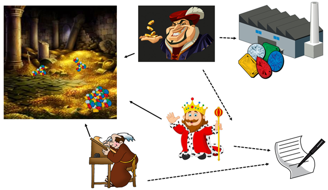

# SDJ2A3
## Assignment 3

## Assignment 3, SDJ2-S19
(Readers & Writers, Flyweight, Singleton)
## The assignment: 
You are going to implement a thread example based on the readers-writers problem.
The below image is a sketch class diagram:
 

This program will simulate a kingdom, where tax collectors collect valuables from the people, accountants count the valuables, and the king spends the valuables to host parties.

You will need at least the following classes:
## 1 - ValuableFactory
The ValuableFactory. This is the factory class in the flyweight pattern. The flyweight objects in this assignment are of the type Valuable. 
This Valuable is either an interface or an abstract class, that is up to you. 
An example of a Valuable sub-class could be:

 

The ValuableFactory is responsible for creating and caching Valuable objects, as specified by the flyweight pattern. Create a couple of different types, e.g.: Diamond, GoldCoin, Jewel, Ruby, WoodenCoin, Cow etc…

## 2 - TreasureRoom
The TreasureRoom contains a list of Valuables. It must control access to this list using a Readers/Writers-problem approach. Which approach is up to you. Pick one from class, or come up with your own.

It must at least have methods to 
1.	add one Valuable to the list
2.	get a Valuable from the list 
3.	remove a Valuable from the list.

## 3 - Accountant
The Accountant is a “reader” class. It implements Runnable, so it can be run in a separate thread. The accountant will have a while(true) loop in the run method. 
1.	He will acquire read access
2.	Count the total sum of the Valuables worth in the list (it may include a sleep to simulate it takes time to count the Valuables)
3.	Print the total sum out
4.	Release read access
5.	Sleep for a little while

## 4 - TaxCollector
The TaxCollector is meant to ride around the country, and collect taxes for the king, in terms of Valuables. He will be given a valuable target, and must collect Valuables until their total worth meets this target.
This class is also Runnable, to be run in a thread.
The TaxCollector will do the following:
1.	Generate a random number, e.g. between 50 and 200.
2.	He will then, a number of times, get a random Valuable from the ValuableFactory (meaning he must know about possible Valuables, which can be retrieved), and between each retrieval of a Valuable sleep for a little while. This will continue, until he has a list of Valuables with a total worth equal to or more than the original target number.
3.	He will then acquire write access to the TreasureRoom
4.	Store all the collected Valuables (one at a time with a sleep in between to simulate that it takes time)
5.	Release write access.
6.	Sleep for a little while
7.	Start over from step 1

## 5 - King
The king will occasionally hold a party, and to pay for this, he will retrieve valuables from the TreasureRoom.
1.	Similar to the TaxCollector, the King will generate a random number, e.g. 50-150, to pay for the next party.
2.	He will acquire write access
3.	Retrieve the valuables one at a time, and if the target worth cannot be met, he will cancel the party, and put the valuables back. (again it could include a sleep to simulate it takes time to get the desired valuables)
4.	Release write access
5.	If the target is met, he will hold a party.
6.	Sleep for a while
7.	Start over

## 6 - Catalog
The last class is logging functionality, to keep track of the income and outcome of the kingdom. Use the Singleton pattern here. 
Use this logger-class to log out to the console, what happens in your program. E.g. when and how much a TaxCollector adds to the TreasureRoom, when the King holds a party or cancels it, when the Accountants has calculated the wealth in the TreasureRoom. You may also include logs when one of them are waiting to enter the TreasureRoom.

You may create other classes if needed.
Create a class with a main method to start the program. Create a bunch of Accountants, a couple of TaxCollectors and one King. Run the program and inspect the output from the Singleton-Logger.
